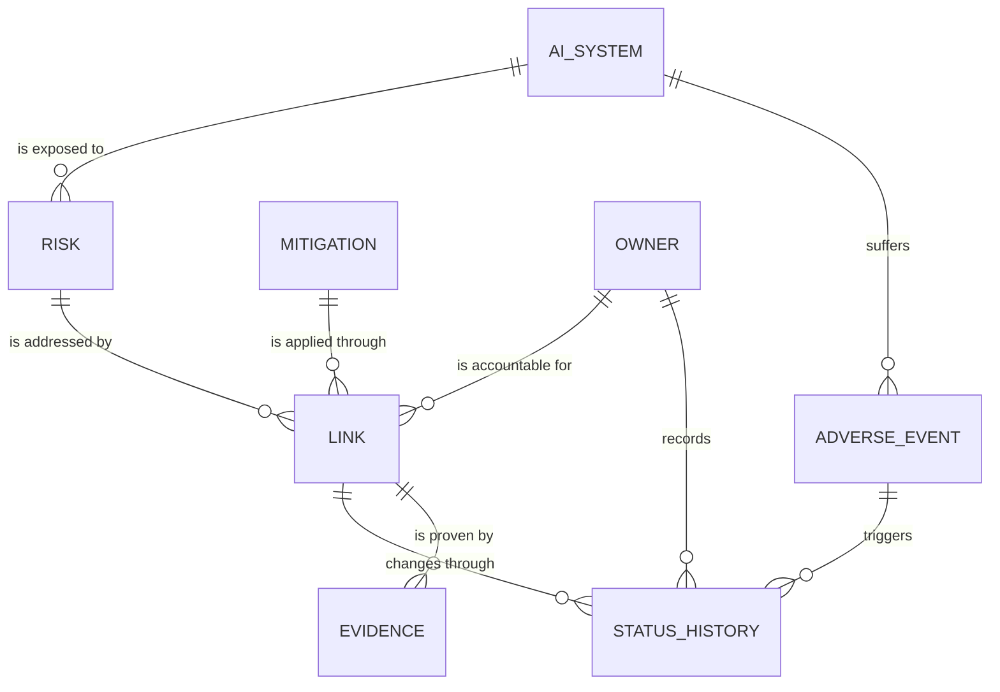

# Framework RME

A web application for managing the risks of AI systems: it keeps a registry of
the AI systems an organization runs, the risks identified for each one, the
adverse events they actually caused, the mitigations that address those risks,
who is accountable for them, and the evidence proving they are in place.

Applied research project — PUCPR.

## Domain model



| Entity          | Table              | What it holds                                                                                         |
| --------------- | ------------------ | ----------------------------------------------------------------------------------------------------- |
| `AiSystem`      | `ai_systems`       | An AI system in the portfolio: name, source type, category, registration date.                        |
| `Risk`          | `risks`            | A risk identified for one system: description, category, lifecycle phase, uncertainty level.          |
| `AdverseEvent`  | `adverse_events`   | Something that went wrong on a system in production: type, description, date.                         |
| `Mitigation`    | `mitigations`      | The reusable catalogue entry: measure, SAERI category, target risk, expected evidence, cost, source.  |
| `Owner`         | `owners`           | The organizational role accountable for a mitigation, and its area.                                   |
| `Link`          | `links`            | **The core entity.** Applies one mitigation to one risk under one owner, with cost, dates and status. |
| `StatusHistory` | `status_histories` | The audit trail of status changes on a link, and what triggered each one.                             |
| `Evidence`      | `evidence`         | An artifact proving a link is in place.                                                               |

Every classification field is a PHP backed enum in [`app/Enums`](app/Enums),
cast on the model and validated with `Rule::enum()`. The columns are plain
strings, so changing an enum needs no migration.

Cost is one of those enums: `CostLevel` (low/medium/high) backs a mitigation's
`suggested_cost` and both cost columns of a link, so an estimate and the cost
actually observed stay comparable. It is deliberately qualitative — if the team
later needs real currency amounts, add a numeric column next to it rather than
widening the scale.

> **Before building on them:** the enum values are a first proposal and several
> carry a `@todo`. `SaeriCategory` and `AdverseEventType` in particular are
> placeholders — replace their cases with the real taxonomy from the source
> paper. The TypeScript mirror of every enum lives in
> [`resources/js/types/models.ts`](resources/js/types/models.ts) and must be
> updated alongside the PHP one.

## Stack

|          |                                                                                |
| -------- | ------------------------------------------------------------------------------ |
| Backend  | Laravel 13 · PHP 8.5                                                           |
| Frontend | React 19 · Inertia v3 · TypeScript · Tailwind v4 · shadcn/ui                   |
| Database | PostgreSQL 18 (Docker)                                                         |
| Auth     | Laravel Fortify (login, registration, password reset, email verification, 2FA) |
| Tests    | Pest 5                                                                         |
| Tooling  | Vite (vite-plus) · Wayfinder · Pint · PHPStan (larastan)                       |

The frontend talks to the backend through **Inertia**, not a REST API:
controllers return `Inertia::render('page/path', [...props])` and the React page
receives those props directly. There is no `/api` layer and no client-side
router.

## Requirements

Docker is the only requirement — the whole stack runs in containers.

To run the app on the host instead (`composer dev`), you also need PHP 8.5 with
the `pdo_pgsql` extension, Composer 2 and Node 22+; Docker then only serves the
database.

## Quick start

```bash
git clone <repo-url> framework-RME
cd framework-RME

cp .env.example .env       # the DB_* defaults already match compose.yml
docker compose up -d       # database + app + vite + queue + logs
```

The app is on http://localhost:8000 and the Vite dev server on
http://localhost:5173. The first `up` builds the image, installs both
dependency trees and seeds a sample portfolio to develop against, so it takes
a few minutes; later ones start in seconds.

Sign in with one of the seeded accounts:

| Email              | Password   |
| ------------------ | ---------- |
| `test@example.com` | `password` |
| `teste@teste.com`  | `teste123` |

## Database

The `postgres` service in `compose.yml` runs PostgreSQL 18. Its credentials
match the `DB_*` values in `.env.example`, so no configuration is needed:

|                 |                                                  |
| --------------- | ------------------------------------------------ |
| Host / port     | `127.0.0.1:5432`                                 |
| Database        | `laravel`                                        |
| User / password | `root` / `root`                                  |
| Volume          | `postgres_data` (survives `docker compose down`) |

```bash
docker compose up -d postgres         # the database on its own
docker compose down                   # stop, keeping the data
docker compose down -v                # stop and wipe the volume (and node_modules)

docker compose exec app php artisan migrate               # apply new migrations
docker compose exec app php artisan migrate:fresh --seed  # drop everything and reseed
docker compose exec postgres psql -U root -d laravel      # a psql shell
```

Drop `docker compose exec app` from those Artisan calls when you work on the
host — the container and the host share the same database.

Tests never touch this database — `phpunit.xml` points them at an in-memory
SQLite connection.

## Development

### In containers

`docker compose up -d` runs the processes of `composer dev`, each as its own
service:

| Service    | Command                                     | What it is                                              |
| ---------- | ------------------------------------------- | ------------------------------------------------------- |
| `postgres` | —                                           | PostgreSQL 18 on :5432                                  |
| `setup`    | `docker/setup.sh`                           | one-shot: dependencies, app key, migrations, first seed |
| `app`      | `php artisan serve` → http://localhost:8000 | `composer dev` › server                                 |
| `vite`     | `npm run dev` → http://localhost:5173       | `composer dev` › vite (HMR + SSR)                       |
| `queue`    | `php artisan queue:listen`                  | `composer dev` › queue (the worker)                     |
| `logs`     | `php artisan pail`                          | `composer dev` › logs                                   |

```bash
docker compose up -d                  # start everything
docker compose logs -f app vite       # follow a few services
docker compose logs -f logs           # the pail stream
docker compose exec app bash          # a shell with php, composer, node and npm
docker compose down                   # stop everything
docker compose up -d --build          # rebuild after editing docker/Dockerfile
```

Everything runs off the bind-mounted working tree, so edits on the host apply
immediately — Vite polls for changes because bind mounts do not forward
filesystem events.

Worth knowing:

- **`queue` is the worker**: `queue:listen` reloads the code on every job, so
  a changed job class takes effect without restarting the container. Swap it
  for `queue:work` if you want the production behaviour instead.
- **`node_modules` is a named volume**, not the host directory: the container
  installs the Linux builds of Rollup, Tailwind Oxide and lightningcss without
  touching the macOS ones. `docker compose down -v` wipes it, and the next `up`
  reinstalls.
- **`setup` runs on every `up`** and is idempotent — it installs what is
  missing, migrates, and seeds only when the database holds no users, so your
  data survives a restart.
- **Both the containers and `composer dev` bind :8000 and :5173**, so run one
  or the other, not both.

### On the host

```bash
docker compose up -d postgres
composer setup                        # install + key:generate + migrate + npm install + npm run build
composer dev
```

This runs the same four processes in one terminal (see `php artisan dev:list`).
Run `npm run dev` on its own if you only need the asset server.

> **`Unable to locate file in Vite manifest`** means the frontend has not been
> built: run `npm run dev` (or `npm run build`) and reload. The same error
> naming a page under `resources/js/pages/` means that page component does not
> exist yet — see below.

## How a feature is wired

Take AI systems as the example; every entity follows the same shape.

```
routes/web.php                          Route::resource('ai-systems', AiSystemController::class)
 └─ app/Http/Controllers/AiSystemController.php
     ├─ app/Policies/AiSystemPolicy.php          Gate::authorize(...)
     ├─ app/Http/Requests/StoreAiSystemRequest.php
     │   └─ app/Concerns/AiSystemValidationRules.php   rules shared by store + update
     ├─ app/Models/AiSystem.php                  #[Fillable], casts, relationships
     └─ Inertia::render('ai-systems/index')
         └─ resources/js/pages/ai-systems/index.tsx
```

- **Validation rules live in a trait** under `app/Concerns`, shared by the
  `Store*` and `Update*` requests, following the existing
  `ProfileValidationRules` convention.
- **Authorization** goes through the policies. They are deliberately permissive
  right now: any authenticated, verified user may do anything. Add roles there,
  not in the controllers.
- **Frontend routes** come from Wayfinder. Import them instead of hardcoding
  URLs; they regenerate on every `npm run dev` / `npm run build`:

    ```tsx
    import { index, show } from '@/routes/ai-systems';

    <Link href={show(aiSystem.id)}>{aiSystem.name}</Link>;
    ```

### Pages still to build

Every page under `resources/js/pages/` for the domain entities is currently a
**placeholder**: it renders the props the controller sent and a TODO note.
Pick one, delete the `<ScaffoldPlaceholder>` and build the real UI — the
backend behind it is done and tested.

| Section        | Page components                             |
| -------------- | ------------------------------------------- |
| AI systems     | `ai-systems/{index,create,show,edit}`       |
| Risks          | `risks/{index,create,show,edit}`            |
| Adverse events | `adverse-events/{index,create,show,edit}`   |
| Mitigations    | `mitigations/{index,create,show,edit}`      |
| Owners         | `owners/{index,create,show,edit}`           |
| Links          | `links/{index,create,show,edit}`            |
| Evidence       | `evidence/{index,create,show,edit}`         |
| Status history | `status-histories/{index,create,show,edit}` |

Evidence and status history are nested under a link
(`/links/{link}/evidence`), because neither exists on its own. Adverse events
hang off an AI system the same way risks do, so they are a top level resource
with the system picked on the form. Run
`php artisan route:list --except-vendor` for the full map.

## Testing

```bash
php artisan test --compact                       # the whole suite
php artisan test --compact tests/Feature/LinkTest.php
vendor/bin/pest --filter="a link can be created"
```

Prefix them with `docker compose exec app` to run them in the container; the
same goes for the quality commands below.

Each entity has a feature test in `tests/Feature/` covering the guest
redirect, the listing, creation, validation failures, updates and deletion.
CI runs the same suite against its own PostgreSQL service
(`.github/workflows/tests.yml`).

## Code quality

```bash
composer lint          # Pint, fixes formatting
composer types:check   # PHPStan level 7 over app/, database/, routes/
npm run check:fix      # lint + format the frontend
npm run types:check    # tsc --noEmit
composer ci:check      # everything CI runs
```

A husky `pre-commit` hook runs `lint-staged` and `composer lint`, so formatting
is fixed before a commit lands.

Commit messages follow the conventional style already used in the history:
`feat:`, `fix:`, `ci:`, `style:`, `chore:`.

## Project structure

```
app/
├── Concerns/          validation rule traits + the enum options helper
├── Enums/             every classification used by the domain
├── Http/
│   ├── Controllers/   one resource controller per entity
│   └── Requests/      Store*/Update* form requests
├── Models/            the eight domain models
└── Policies/          one policy per entity

database/
├── factories/         factories with states (implemented, dueForReview, ...)
├── migrations/        the schema
└── seeders/           one seeder per entity, chained by DatabaseSeeder

resources/js/
├── components/        shared React components
├── pages/             one directory per entity, mapped to Inertia::render()
├── routes/            generated by Wayfinder — do not edit
└── types/models.ts    TypeScript mirror of the models and enums

docker/
├── Dockerfile         the dev image: PHP 8.5 + Node 22 + Composer
└── setup.sh           what the `setup` service runs on every `up`
compose.yml            every service of the development stack
```

## Periodic reassessment

A link's `next_review_date` is computed when the link is created: the creation
date plus the review periodicity of `config/rme.php`, which defaults to 180 days
and is overridden with `RME_REVIEW_INTERVAL_DAYS`. The date is only editable
afterwards, so a review that happened can push the next one forward.

`links:flag-due-for-review` lists the links whose review date has arrived and
logs a warning with their count. It only reports: no status changes, no history
rows, so every state change still has a person behind it. The schedule runs it
daily at 07:00, and nothing runs the scheduler by itself — start it with
`php artisan schedule:work`, or trigger the command by hand:

```bash
php artisan links:flag-due-for-review
```

## Not implemented yet

Adverse events are recorded and can be named as the trigger of a status change,
but nothing reacts to one yet: registering an event does not reopen or reassess
the links covering the risk it materialized. That rule is still to be defined.
