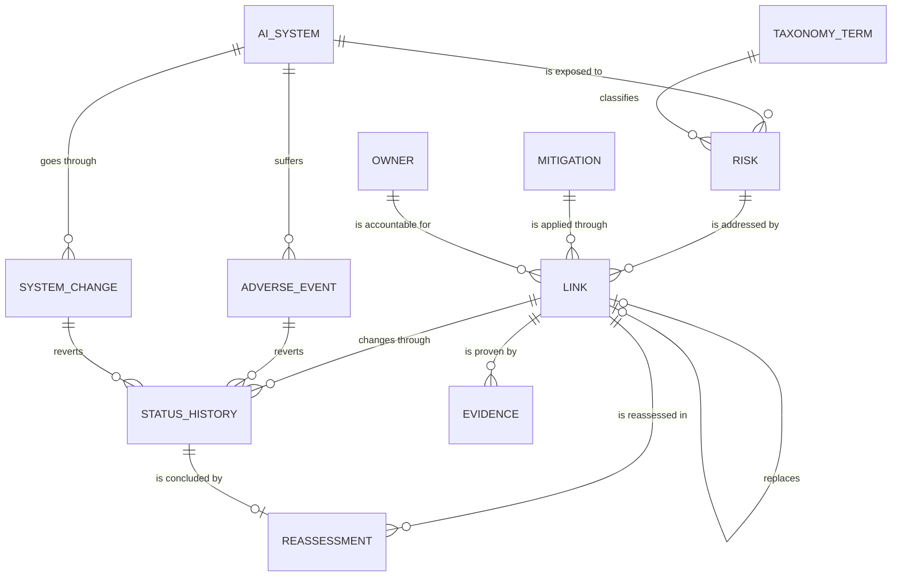

# Framework RME

A web application for managing the risks of AI systems. It keeps a registry of
the AI systems an organization runs, the risks identified for each one, the
mitigations applied to those risks, who is accountable for each, and the
evidence proving they are in place. It then keeps that claim honest over time:
review deadlines, adverse events and changes to a system take verified
mitigations back to reassessment, and every step lands in an append-only audit
trail exported as a traceability report.

Applied research project — PUCPR.

## Domain model


```mermaid
erDiagram
    AI_SYSTEM     ||--o{ RISK           : "is exposed to"
    AI_SYSTEM     ||--o{ ADVERSE_EVENT  : "suffers"
    AI_SYSTEM     ||--o{ SYSTEM_CHANGE  : "goes through"
    RISK          ||--o{ LINK           : "is addressed by"
    MITIGATION    ||--o{ LINK           : "is applied through"
    OWNER         ||--o{ LINK           : "is accountable for"
    LINK          ||--o{ STATUS_HISTORY : "changes through"
    LINK          ||--o{ EVIDENCE       : "is proven by"
    LINK          ||--o{ REASSESSMENT   : "is reassessed in"
    LINK          |o--o| LINK           : "replaces"
    ADVERSE_EVENT ||--o{ STATUS_HISTORY : "reverts"
    SYSTEM_CHANGE ||--o{ STATUS_HISTORY : "reverts"
    STATUS_HISTORY ||--o| REASSESSMENT  : "is concluded by"
    TAXONOMY_TERM ||--o{ RISK           : "classifies"
```

| Entity          | Table              | What it holds                                                                                                                        |
| --------------- | ------------------ | ------------------------------------------------------------------------------------------------------------------------------------ |
| `AiSystem`      | `ai_systems`       | An AI system in the portfolio: name, application domain, source type, EU AI Act tier, registration date.                             |
| `Risk`          | `risks`            | A risk identified for one system: name, description, MIT risk subdomain, lifecycle phase, uncertainty level.                         |
| `Mitigation`    | `mitigations`      | A read-only catalogue entry: measure, Saeri et al. subcategory, target risk subdomains, expected evidence, suggested cost, source.   |
| `Owner`         | `owners`           | The organizational role accountable for a mitigation, and its area. Deactivated rather than deleted once in use.                     |
| `Link`          | `links`            | **The core entity.** Applies one mitigation to one risk under one owner, with a progress status and a verification status.           |
| `Evidence`      | `evidence`         | An artifact proving a link is in place, optionally with the cost actually observed. Append-only.                                     |
| `StatusHistory` | `status_histories` | The append-only audit trail of a link: every change of progress or verification, with its origin, author or trigger.                 |
| `AdverseEvent`  | `adverse_events`   | An incident or a near miss on a system, classified by MIT risk subdomains. Append-only.                                              |
| `SystemChange`  | `system_changes`   | A new model version or a data change of a system, optionally naming the risk subdomains it reaches. Append-only.                     |
| `Reassessment`  | `reassessments`    | The conclusion of one reversal: outcome (maintain, adjust, replace, close), owner, justification, cause analysis and changes made.   |
| `Taxonomy`      | `taxonomies`       | A versioned reference taxonomy (MIT AI risk domains, Saeri et al. mitigations), with its citation; `TaxonomyTerm` holds its entries. |

A link has **two status dimensions**: its progress (`planned`,`in_progress`,
`implemented`, `monitoring`, `suspended`, `cancelled`) and its verification
(`declared` or `verified`). A link is only _verified_ on evidence recorded
after its last verification change, and a verified link carries a review
date. Links are never deleted: they end by cancellation, and a replacement
points at the link it replaces.

Every classification field is a PHP backed enum in [`app/Enums`](app/Enums),
cast on the model and validated with `Rule::enum()`. The columns are plain
strings, so changing an enum needs no migration. The TypeScript mirror of every
enum lives in [`resources/js/types/models.ts`](resources/js/types/models.ts),
with its pt-BR labels in [`resources/js/lib/labels.ts`](resources/js/lib/labels.ts),
and both must be updated alongside the PHP one.

Cost is one of those enums: `CostLevel` (low/medium/high) backs a mitigation's
`suggested_cost`, a link's `estimated_cost` and the cost observed on evidence,
so an estimate and the actual cost stay comparable. It is deliberately
qualitative — if the team later needs real currency amounts, add a numeric
column next to it rather than widening the scale.

> **Still to confirm:** several enums (`AiSystemCategory`, `CostLevel`,
> `EvidenceType`, `LifecyclePhase`, `LinkStatus`, `SystemSourceType`,
> `UncertaintyLevel`) carry a `@todo` to check their values against the RME
> framework definition.

### Reference data

The taxonomies, the mitigation catalogue and the monitoring protocol are
versioned JSON files under [`database/data`](database/data), loaded by the
seeders and validated on load (`app/Support`):

| File                                        | What it holds                                                                                        |
| ------------------------------------------- | ---------------------------------------------------------------------------------------------------- |
| `taxonomies/mit-ai-risk-domains.json`       | The MIT AI Risk Repository domain taxonomy (7 domains, 24 subdomains), classifying risks and events. |
| `taxonomies/saeri-mitigation-taxonomy.json` | The preliminary mitigation taxonomy of Saeri et al., classifying the catalogue.                      |
| `mitigation-catalog.json`                   | The mitigation catalogue. **Currently fictional** (`meta.fictional`), pending the group's curation.  |
| `protocols/c3-monitoring-protocol.json`     | The C3 monitoring protocol: review interval per EU AI Act tier and the dashboard windows.            |

### Domain decisions

The business rules are recorded, in Portuguese, in
[`docs/decisions`](docs/decisions/README.md), one numbered decision per file.
Read the matching decision before changing a rule, and check
[`PENDENTES.md`](docs/decisions/PENDENTES.md) before implementing anything
not yet decided there.

## Stack

|          |                                                                                |
| -------- | ------------------------------------------------------------------------------ |
| Backend  | Laravel 13 · PHP 8.5                                                           |
| Frontend | React 19 · Inertia v3 · TypeScript · Tailwind v4 · shadcn/ui                   |
| Database | PostgreSQL 18 (Docker)                                                         |
| Auth     | Laravel Fortify (login, registration, password reset, email verification, 2FA) |
| Tests    | Pest 5                                                                         |
| Tooling  | Vite (vite-plus) · Wayfinder · Pint · PHPStan (larastan)                       |

The frontend talks to the backend through **Inertia**, not a REST API:
controllers return `Inertia::render('page/path', [...props])` and the React page
receives those props directly. There is no `/api` layer and no client-side
router.

## Requirements

Docker is the only requirement — the whole stack runs in containers.

To run the app on the host instead (`composer dev`), you also need PHP 8.5 with
the `pdo_pgsql` extension, Composer 2 and Node 22+; Docker then only serves the
database.

## Quick start

```bash
git clone <repo-url> framework-RME
cd framework-RME

cp .env.example .env       # the DB_* defaults already match compose.yml
docker compose up -d       # database + app + vite + queue + scheduler + logs
```

The app is on http://localhost:8000 and the Vite dev server on
http://localhost:5173. The first `up` builds the image, installs both
dependency trees and seeds a sample portfolio to develop against, so it takes
a few minutes; later ones start in seconds.

Sign in with one of the seeded accounts:

| Email              | Password   |
| ------------------ | ---------- |
| `test@example.com` | `password` |
| `teste@teste.com`  | `teste123` |

## Database

The `postgres` service in `compose.yml` runs PostgreSQL 18. Its credentials
match the `DB_*` values in `.env.example`, so no configuration is needed:

|                 |                                                  |
| --------------- | ------------------------------------------------ |
| Host / port     | `127.0.0.1:5432`                                 |
| Database        | `laravel`                                        |
| User / password | `root` / `root`                                  |
| Volume          | `postgres_data` (survives `docker compose down`) |

```bash
docker compose up -d postgres         # the database on its own
docker compose down                   # stop, keeping the data
docker compose down -v                # stop and wipe the volume (and node_modules)

docker compose exec app php artisan migrate               # apply new migrations
docker compose exec app php artisan migrate:fresh --seed  # drop everything and reseed
docker compose exec postgres psql -U root -d laravel      # a psql shell
```

Drop `docker compose exec app` from those Artisan calls when you work on the
host — the container and the host share the same database.

Tests never touch this database — `phpunit.xml` points them at an in-memory
SQLite connection.

## Development

### In containers

`docker compose up -d` runs the processes of `composer dev`, each as its own
service:

| Service     | Command                                     | What it is                                              |
| ----------- | ------------------------------------------- | ------------------------------------------------------- |
| `postgres`  | —                                           | PostgreSQL 18 on :5432                                  |
| `setup`     | `docker/setup.sh`                           | one-shot: dependencies, app key, migrations, first seed |
| `app`       | `php artisan serve` → http://localhost:8000 | `composer dev` › server                                 |
| `vite`      | `npm run dev` → http://localhost:5173       | `composer dev` › vite (HMR + SSR)                       |
| `queue`     | `php artisan queue:listen`                  | `composer dev` › queue (the worker)                     |
| `scheduler` | `php artisan schedule:work`                 | the schedule of `routes/console.php`, every minute      |
| `logs`      | `php artisan pail`                          | `composer dev` › logs                                   |

```bash
docker compose up -d                  # start everything
docker compose logs -f app vite       # follow a few services
docker compose logs -f logs           # the pail stream
docker compose exec app bash          # a shell with php, composer, node and npm
docker compose down                   # stop everything
docker compose up -d --build          # rebuild after editing docker/Dockerfile
```

Everything runs off the bind-mounted working tree, so edits on the host apply
immediately — Vite polls for changes because bind mounts do not forward
filesystem events.

Worth knowing:

- **`queue` is the worker**: `queue:listen` reloads the code on every job, so
  a changed job class takes effect without restarting the container. Swap it
  for `queue:work` if you want the production behaviour instead.
- **`scheduler` runs the schedule**: `schedule:work` checks `routes/console.php`
  every minute and runs what is due, such as `links:flag-due-for-review` at
  07:00. It only lives while the containers are up; see
  [Running the schedule](#running-the-schedule) for production.
- **`node_modules` is a named volume**, not the host directory: the container
  installs the Linux builds of Rollup, Tailwind Oxide and lightningcss without
  touching the macOS ones. `docker compose down -v` wipes it, and the next `up`
  reinstalls.
- **`setup` runs on every `up`** and is idempotent — it installs what is
  missing, migrates, and seeds only when the database holds no users, so your
  data survives a restart.
- **Both the containers and `composer dev` bind :8000 and :5173**, so run one
  or the other, not both.

### On the host

```bash
docker compose up -d postgres
composer setup                        # install + key:generate + migrate + npm install + npm run build
composer dev
```

This runs the same four processes in one terminal (see `php artisan dev:list`).
Run `npm run dev` on its own if you only need the asset server.

> **`Unable to locate file in Vite manifest`** means the frontend has not been
> built: run `npm run dev` (or `npm run build`) and reload. The same error
> naming a page under `resources/js/pages/` means that page component does not
> exist yet — see below.

## How a feature is wired

Take AI systems as the example; every entity follows the same shape.

```
routes/web.php                          Route::resource('ai-systems', AiSystemController::class)
 └─ app/Http/Controllers/AiSystemController.php
     ├─ app/Policies/AiSystemPolicy.php          Gate::authorize(...)
     ├─ app/Http/Requests/StoreAiSystemRequest.php
     │   └─ app/Concerns/AiSystemValidationRules.php   rules shared by store + update
     ├─ app/Actions/UpdateAiSystem.php           writes with side effects
     ├─ app/Models/AiSystem.php                  #[Fillable], casts, relationships
     └─ Inertia::render('ai-systems/index')
         └─ resources/js/pages/ai-systems/index.tsx
```

- **Writes with side effects go through an Action** in `app/Actions`, inside a
  transaction. In particular, `RecordStatusChange` is the **single write path**
  for a link's status: opening, progress changes, verification and reversal all
  pass through it, so the history and the rules cannot be bypassed (decision
  0007). The other actions — `RecordAdverseEvent`, `RecordSystemChange`,
  `RecordReassessment`, `UpdateAiSystem`, `RevertOverdueLinks` — call it.
- **Append-only records** (status history, evidence, adverse events, system
  changes, reassessments) expose no `edit`, `update` or `destroy` routes. Those
  that belong to another record are nested under it with `shallow()`, such as
  `/links/{link}/reassessments/create` and `/reassessments/{reassessment}`.
- **Validation rules live in a trait** under `app/Concerns`, shared by the
  `Store*` and `Update*` requests, following the existing
  `ProfileValidationRules` convention.
- **Authorization** goes through the policies. They are deliberately permissive
  right now: any authenticated, verified user may do anything. Add roles there,
  not in the controllers.
- **Frontend routes** come from Wayfinder. Import them instead of hardcoding
  URLs; they regenerate on every `npm run dev` / `npm run build`:

    ```tsx
    import { index, show } from '@/routes/ai-systems';

    <Link href={show(aiSystem.id)}>{aiSystem.name}</Link>;
    ```

- **The interface is in pt-BR**, while code, routes and enum values are in
  English. Backend messages are translated in `lang/pt.json` and
  `lang/pt/validation.php`.

Run `php artisan route:list --except-vendor` for the full route map.

### Screens

| Section        | What it does                                                                                                                                                                             |
| -------------- | ---------------------------------------------------------------------------------------------------------------------------------------------------------------------------------------- |
| Dashboard      | Portfolio totals, risks without links, links without evidence, links awaiting verification or reassessment (by origin), reviews coming due, recent adverse events, risks not yet mapped. |
| AI systems     | The portfolio; each system shows its risks, system changes, and the traceability report downloads.                                                                                       |
| Risks          | Risks per system, classified by MIT subdomain, with their links.                                                                                                                         |
| Mitigations    | The read-only catalogue, with its Saeri et al. classification and source.                                                                                                                |
| Owners         | Accountable roles; deactivated instead of deleted once used.                                                                                                                             |
| Links          | Filterable list by progress, verification and reversal origin; each link has its timeline, evidence and reassessments.                                                                   |
| Adverse events | Recording an incident or near miss, with a preview of the links it will revert.                                                                                                          |
| System changes | Recording a model version or data change on a system, with a preview of the links it will revert.                                                                                        |
| Reassessments  | Concluding a reversal with an outcome, cause analysis and adjustments.                                                                                                                   |

## Testing

```bash
php artisan test --compact                       # the whole suite
php artisan test --compact tests/Feature/LinkTest.php
vendor/bin/pest --filter="a link can be created"
```

Prefix them with `docker compose exec app` to run them in the container; the
same goes for the quality commands below.

Each entity has a feature test in `tests/Feature/` covering the guest
redirect, the listing, creation, validation failures and, where allowed,
updates and deletion. The rules of each decision have their own files
(`LinkVerificationTest`, `ReassessmentTest`, `SystemChangeTest`, ...), and a
seeder test checks that the sample data tells every story through the actions.

Locally the suite runs on an in-memory SQLite database (`phpunit.xml`); CI runs
it against its own PostgreSQL service (`.github/workflows/tests.yml`). Some
rules are database CHECK constraints, so run it on PostgreSQL too before
pushing a schema change:

```bash
docker compose exec postgres createdb -U root testing     # once
docker compose exec -e DB_CONNECTION=pgsql -e DB_HOST=postgres -e DB_DATABASE=testing \
    app php artisan test --compact
```

## Code quality

```bash
composer lint          # Pint, fixes formatting
composer types:check   # PHPStan level 7 over app/, database/, routes/
npm run check:fix      # lint + format the frontend
npm run types:check    # tsc --noEmit
composer ci:check      # everything CI runs
```

A husky `pre-commit` hook runs `lint-staged` and `composer lint`, so formatting
is fixed before a commit lands.

Commit messages follow the conventional style already used in the history:
`feat:`, `fix:`, `ci:`, `style:`, `chore:`.

## Project structure

```
app/
├── Actions/           the write paths: RecordStatusChange and the actions built on it
├── Concerns/          validation rule traits + the enum options helper
├── Console/Commands/  links:flag-due-for-review
├── Enums/             every classification used by the domain
├── Http/
│   ├── Controllers/   one controller per entity, plus the dashboard and the report
│   └── Requests/      Store*/Update* form requests
├── Models/            the domain models
├── Policies/          one policy per entity
└── Support/           reference data loaders: taxonomies, catalogue, monitoring protocol

database/
├── data/              versioned reference files (taxonomies, catalogue, protocol)
├── factories/         factories with states (implemented, highRisk, inSubdomain, ...)
├── migrations/        the schema
└── seeders/           one seeder per entity, chained by DatabaseSeeder

docs/decisions/        the domain decision records, in Portuguese

lang/                  pt-BR translations of backend messages

resources/js/
├── components/        shared React components
├── lib/               labels, formatting and the pure preview functions
├── pages/             one directory per entity, mapped to Inertia::render()
├── routes/            generated by Wayfinder — do not edit
└── types/models.ts    TypeScript mirror of the models and enums

docker/
├── Dockerfile         the dev image: PHP 8.5 + Node 22 + Composer
└── setup.sh           what the `setup` service runs on every `up`
compose.yml            every service of the development stack
```

The seeders build the sample portfolio **through the actions**, travelling in
time, so the data follows the same rules as the app: links verified on
evidence, reversed by each trigger, reassessed with each outcome.

## Verification and reassessment

A link's `next_review_date` is set when the link is verified: the verification
date plus the review interval of the EU AI Act tier of the risk's system, as the
C3 protocol file `database/data/protocols/c3-monitoring-protocol.json` sets it
(high 90 days, limited 180, minimal 365). A declared link has no review date,
and a system in the unacceptable tier never operates, so its links cannot be
verified — they serve to plan its discontinuation. The rules are recorded in
decisions 0017 and 0018.

### Triggers

Five triggers take a verified link back to declared, awaiting reassessment.
Each reversal is recorded in the status history with its origin and, when
automatic, no author:

- **Review due** — `links:flag-due-for-review` reverts the links past their
  review date. The date is the last valid day: a link due today is shown as
  "Vence hoje" and reverted from the next day. Running it twice on the same day
  changes nothing more.
- **Adverse event** — recording an event reverts, in the same transaction, the
  verified links of the system whose risk is in one of the event's subdomains,
  except the link that intercepted a near miss.
- **Reclassification** — editing a system into the unacceptable tier reverts
  all its verified links.
- **New model version** and **data change** — recording a system change
  reverts the verified links of the system whose risk is in one of the
  subdomains it names, or **all** of them when it names none.
- **Manual** — a user may revert a verified link by hand, with a reason.

An event or a change naming a subdomain the system has no risk for shows on the
dashboard as a risk not yet mapped, with a shortcut to register it.

### Reassessment

Each reversal is concluded by one reassessment, with an owner and a justification:

| Outcome      | Effect                                                                                                  |
| ------------ | ------------------------------------------------------------------------------------------------------- |
| **Maintain** | Verifies the link again, on evidence recorded after the reversal.                                       |
| **Adjust**   | Changes the owner, estimated cost, lifecycle phase or progress; verifying in the same step is optional. |
| **Replace**  | Cancels the link and opens the form for its replacement, of the same risk.                              |
| **Close**    | Cancels the link.                                                                                       |

A reversal from an adverse event or a manual one asks for a cause analysis
(identified, with the cause and its lifecycle phase, or not identified); a
review due, a reclassification or a system change does not. Maintain and
replace are unavailable for a system in the unacceptable tier.

### Traceability report

Each AI system page offers four downloads:

| Download             | Route                                | Content                                                                          |
| -------------------- | ------------------------------------ | -------------------------------------------------------------------------------- |
| JSON                 | `ai-systems/{id}/report.json`        | The full chain: risks, links, evidence, history, reassessments, events, changes. |
| CSV                  | `ai-systems/{id}/report.csv`         | One row per link.                                                                |
| Adverse events (CSV) | `ai-systems/{id}/adverse-events.csv` | One row per event, including those that reverted nothing.                        |
| System changes (CSV) | `ai-systems/{id}/system-changes.csv` | One row per change, including those that reverted nothing.                       |

The CSV files are UTF-8 with a BOM and `;` as the delimiter, so they open
directly in a pt-BR spreadsheet, and cells that look like formulas are
neutralised. Every file carries the version of the monitoring protocol it was
produced under.

### Running the schedule

The schedule runs `links:flag-due-for-review` daily at 07:00. In development
the `scheduler` service runs the schedule while the containers are up; outside
them, run `php artisan schedule:work`, or trigger the command by hand:

```bash
php artisan links:flag-due-for-review
```

In production nothing runs the schedule by itself: the server needs a cron
entry that calls `php artisan schedule:run` every minute (or a process manager
keeping `schedule:work` alive). Without it, links past their review date are
never reverted.
